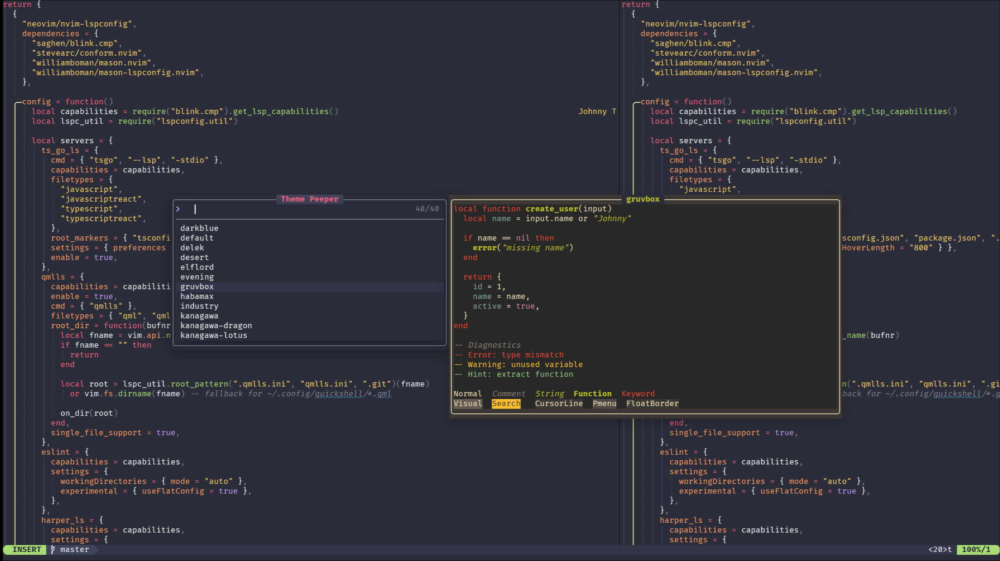

# theme-peeper.nvim

Live-preview Neovim colorschemes before applying them.

`theme-peeper.nvim` captures a colorscheme inside a child Neovim process, reads the resulting highlight groups, and renders an isolated preview in your current session. Your active colorscheme is not changed until you confirm the selection.



## Features

- Live colorscheme preview before applying
- Best experience with [`snacks.nvim`](https://github.com/folke/snacks.nvim)
- Optional Telescope picker support
- Built-in `vim.ui.select` fallback
- Isolated floating preview window
- Child-process highlight capture
- Uses your current `runtimepath`, `background`, `termguicolors`, and safe scalar globals
- Configurable preview profiles
- Custom preview sample lines, spans, and highlight groups
- Custom apply function
- Custom picker support
- Custom previewer support
- In-memory capture cache

## Requirements

- Neovim `0.10+`
- `nvim` executable available on `$PATH`

Optional:

- [`snacks.nvim`](https://github.com/folke/snacks.nvim)
- [`telescope.nvim`](https://github.com/nvim-telescope/telescope.nvim)

`theme-peeper.nvim` uses `vim.system()`, so Neovim `0.10+` is required.

## Installation

### Recommended setup with `lazy.nvim` and Snacks

This is the intended setup. Snacks gives Theme Peeper the best live-preview experience because the preview updates as you move through the picker.

```lua
{
  "JohnnyJumper/theme-peeper.nvim",
  dependencies = {
    {
      "folke/snacks.nvim",
      opts = {
        picker = {},
      },
    },
  },
  keys = {
    {
      "<leader>tp",
      function()
        require("theme_peeper").select()
      end,
      desc = "Theme Peeper",
    },
  },
  opts = {
    picker = "snacks",
    previewer = "float",

    preview = {
      profile = "code",
      max_height = 24,
      border = "rounded",
      placement = "center",
    },

    pickers = {
      snacks = {
        width = 56,
        max_height = 12,
        preview_width = 80,
        preview_max_height = 24,
      },
    },
  },
}
```

### Without Snacks

Theme Peeper also works without extra dependencies by using `vim.ui.select`.

```lua
{
  "JohnnyJumper/theme-peeper.nvim",
  keys = {
    {
      "<leader>tp",
      function()
        require("theme_peeper").select()
      end,
      desc = "Theme Peeper",
    },
  },
  opts = {
    picker = "builtin",
    previewer = "float",
  },
}
```

The built-in picker is a fallback. It is useful, but it does not provide the same smooth live-preview flow as Snacks.

## Usage

Open the theme picker:

```vim
:ThemePeep
```

Preview a specific colorscheme:

```vim
:ThemePeepPreview kanagawa
```

Open the picker from Lua:

```lua
require("theme_peeper").select()
```

Preview a theme from Lua:

```lua
require("theme_peeper").peek("kanagawa")
```

Apply a theme from Lua:

```lua
require("theme_peeper").apply("kanagawa")
```

## Commands

| Command | Description |
|---|---|
| `:ThemePeep` | Open the configured theme picker |
| `:ThemePeepPreview <theme>` | Preview a specific colorscheme |

## Picker backends

### Snacks

```lua
require("theme_peeper").setup({
  picker = "snacks",

  pickers = {
    snacks = {
      width = 56,
      max_height = 12,
      preview_width = 80,
      preview_max_height = 24,
    },
  },
})
```

Snacks is the recommended picker backend.

When the selection changes, Theme Peeper captures the selected colorscheme and renders the preview beside the picker when possible.

If Snacks is not installed or not available, Theme Peeper falls back to the built-in picker.

### Built-in picker

```lua
require("theme_peeper").setup({
  picker = "builtin",
})
```

The built-in picker uses `vim.ui.select`.

It requires no dependencies. It is the safest fallback, but the experience is more limited than Snacks.

### Telescope

```lua
require("theme_peeper").setup({
  picker = "telescope",

  pickers = {
    telescope = {
      width = 56,
      max_height = 12,
    },
  },
})
```

Telescope selection movement is wired through Theme Peeper mappings so the preview updates as the selection changes.

If Telescope is not installed or not available, Theme Peeper falls back to the built-in picker.

## Configuration

Example full setup:

```lua
require("theme_peeper").setup({
  picker = "snacks",
  previewer = "float",

  apply = function(theme)
    vim.cmd.colorscheme(theme)
  end,

  capture = {
    globals = {
      -- Example:
      -- some_theme_option = "dark",
      -- some_theme_transparent = true,
    },
  },

  preview = {
    profile = "code",
    max_height = 24,
    zindex = 80,
    border = "rounded",
    placement = "center",
  },

  cache = {
    enabled = true,
  },

  mappings = {
    preview = {
      close = { "q", "<Esc>" },
    },

    telescope = {
      next = {
        insert = { "<Down>", "<C-n>" },
        normal = { "j", "<Down>" },
      },
      previous = {
        insert = { "<Up>", "<C-p>" },
        normal = { "k", "<Up>" },
      },
    },
  },

  pickers = {
    builtin = {
      max_height = 12,
    },

    snacks = {
      width = 56,
      max_height = 12,
      row = 0.5,
      col = 0.5,
      preview_width = 80,
      preview_max_height = 24,
    },

    telescope = {
      width = 56,
      max_height = 12,
    },
  },
})
```

## Preview profiles

Theme Peeper includes built-in preview profiles.

```lua
require("theme_peeper").setup({
  preview = {
    profile = "code",
  },
})
```

Available profiles:

| Profile | Description |
|---|---|
| `code` | General code-oriented preview |
| `diagnostics` | Diagnostics and code sample preview |
| `ui` | UI highlight groups such as floats, menus, statusline, separators, and line numbers |
| `minimal` | Compact preview |

Example:

```lua
require("theme_peeper").setup({
  preview = {
    profile = "ui",
  },
})
```

## Custom preview sample

You can provide custom preview lines and highlight spans.

```lua
require("theme_peeper").setup({
  preview = {
    sample_lines = {
      "package main",
      "",
      "func main() {",
      '  println("hello")',
      "}",
    },

    spans = {
      { line = 1, word = "package", group = "Keyword" },
      { line = 1, word = "main", group = "Identifier" },
      { line = 3, word = "func", group = "Keyword" },
      { line = 3, word = "main", group = "Function" },
      { line = 4, word = '"hello"', group = "String" },
    },
  },
})
```

A span can target text by word:

```lua
{ line = 1, word = "local", group = "Keyword" }
```

By Lua pattern:

```lua
{ line = 1, pattern = "function%s+[%w_]+", group = "Function" }
```

By explicit columns:

```lua
{ line = 1, start_col = 0, end_col = 5, group = "Keyword" }
```

Columns are zero-based.

## Extra highlight groups

Use `groups` when you want the preview namespace to define additional highlight groups even if they are not directly used by spans.

```lua
require("theme_peeper").setup({
  preview = {
    groups = {
      "DiffAdd",
      "DiffChange",
      "DiffDelete",
      "GitSignsAdd",
      "GitSignsChange",
      "GitSignsDelete",
    },
  },
})
```

## Custom apply function

By default, confirming a theme runs:

```lua
vim.cmd.colorscheme(theme)
```

Override `apply` when your theme switch needs extra work.

```lua
require("theme_peeper").setup({
  apply = function(theme)
    vim.cmd.colorscheme(theme)
    vim.notify("Applied colorscheme: " .. theme)
  end,
})
```

This is useful when applying a theme also needs to update plugin state, persist a config value, or refresh UI components.

## Capture behavior

Theme Peeper captures themes by launching a child Neovim process.

The child process receives:

- Current `runtimepath`
- Current `termguicolors`
- Current `background`
- Safe scalar `vim.g` values
- Explicit `capture.globals`

Then it runs:

```lua
vim.cmd.colorscheme(payload.theme)
```

After that, it reads the effective highlight groups and returns them to the parent process.

This keeps your current Neovim session unchanged while still producing a realistic preview.

## Explicit capture globals

Some themes use global variables for configuration.

You can pass extra globals into the child process:

```lua
require("theme_peeper").setup({
  capture = {
    globals = {
      some_theme_option = "mocha",
      some_theme_transparent = true,
    },
  },
})
```

Explicit globals override inherited globals with the same name.

## Capture limitations

Theme Peeper does not replay arbitrary Lua setup code inside the child process.

For example, this setup is not automatically replayed:

```lua
require("some-theme").setup({
  style = "dark",
  integrations = {
    telescope = true,
  },
})
```

If a theme depends on setup-time Lua tables or functions, the preview may not perfectly match your fully configured session.

Themes that expose scalar globals or mainly rely on normal `colorscheme` files should preview closely.

## Cache

Theme captures are cached in memory.

Caching is enabled by default:

```lua
require("theme_peeper").setup({
  cache = {
    enabled = true,
  },
})
```

Disable cache globally:

```lua
require("theme_peeper").setup({
  cache = {
    enabled = false,
  },
})
```

Disable cache for a single preview call:

```lua
require("theme_peeper").preview("kanagawa", {
  cache = false,
})
```

The cache key includes the capture payload. Changes to inherited globals, explicit globals, `runtimepath`, `background`, or `termguicolors` can create a new cache entry.

## Preview window

Default float preview configuration:

```lua
require("theme_peeper").setup({
  preview = {
    profile = "code",
    max_height = 24,
    zindex = 80,
    border = "rounded",
    placement = "center",
  },
})
```

Supported placement values:

| Placement | Description |
|---|---|
| `center` | Center the preview in the editor |
| `attached` | Attach the preview to an anchor, placing it below when there is space and beside it when there is not |
| `below` | Use anchor-based placement; currently follows the same auto-fit behavior as `attached` |

Picker integrations may override placement internally to keep the picker and preview visually connected.

## Preview mappings

Default preview mappings:

```lua
require("theme_peeper").setup({
  mappings = {
    preview = {
      close = { "q", "<Esc>" },
    },
  },
})
```

Disable preview mappings:

```lua
require("theme_peeper").setup({
  mappings = {
    preview = false,
  },
})
```

Use custom close keys:

```lua
require("theme_peeper").setup({
  mappings = {
    preview = {
      close = { "q", "<C-c>" },
    },
  },
})
```

## Telescope mappings

Default Telescope movement mappings:

```lua
require("theme_peeper").setup({
  mappings = {
    telescope = {
      next = {
        insert = { "<Down>", "<C-n>" },
        normal = { "j", "<Down>" },
      },
      previous = {
        insert = { "<Up>", "<C-p>" },
        normal = { "k", "<Up>" },
      },
    },
  },
})
```

Disable Theme Peeper Telescope mappings:

```lua
require("theme_peeper").setup({
  mappings = {
    telescope = false,
  },
})
```

## Custom picker

You can provide a custom picker function.

```lua
require("theme_peeper").setup({
  picker = function(actions, opts)
    local themes = actions.list()

    vim.ui.select(themes, {
      prompt = "Select colorscheme",
    }, function(theme)
      if not theme then
        actions.close()
        return
      end

      actions.confirm(theme)
    end)
  end,
})
```

A custom picker receives:

| Argument | Description |
|---|---|
| `actions` | Theme Peeper action API |
| `opts` | Picker options |

Available actions:

```lua
actions.list()
actions.capture(theme, opts)
actions.render(opts)
actions.preview(theme, opts)
actions.apply(theme)
actions.confirm(theme, opts)
actions.close()
```

## Custom previewer

You can provide a custom previewer function.

```lua
require("theme_peeper").setup({
  previewer = function(ctx)
    -- ctx.theme
    -- ctx.captured
    -- ctx.opts
    -- ctx.actions
    -- ctx.render
    -- ctx.buf
    -- ctx.win

    return ctx.render({
      buf = ctx.buf,
      win = ctx.win,
      captured = ctx.captured,
      preview = ctx.opts,
    })
  end,
})
```

A custom previewer receives:

| Field | Description |
|---|---|
| `ctx.theme` | Theme name being previewed |
| `ctx.captured` | Captured highlight data |
| `ctx.opts` | Merged preview options |
| `ctx.actions` | Theme Peeper action API |
| `ctx.render` | Renderer function |
| `ctx.buf` | Optional buffer passed by caller |
| `ctx.win` | Optional window passed by caller |

## Lua API

### `setup(opts)`

Configure the plugin.

```lua
require("theme_peeper").setup({
  picker = "snacks",
})
```

### `select()`

Open the configured picker.

```lua
require("theme_peeper").select()
```

### `preview(theme, opts)`

Preview a theme by name.

```lua
local ok, err = require("theme_peeper").preview("kanagawa")
```

With options:

```lua
require("theme_peeper").preview("kanagawa", {
  cache = false,
  placement = "center",
})
```

### `peek(theme)`

Preview a theme by name and notify on error.

```lua
require("theme_peeper").peek("kanagawa")
```

### `apply(theme)`

Apply a theme using the configured apply function.

```lua
require("theme_peeper").apply("kanagawa")
```

### `confirm(theme, opts)`

Close the preview and apply a theme.

```lua
require("theme_peeper").confirm("kanagawa")
```

Keep the preview open after confirming:

```lua
require("theme_peeper").confirm("kanagawa", {
  close_preview = false,
})
```

### `capture(theme, opts)`

Capture a theme and return its highlight data.

```lua
local captured, err = require("theme_peeper").capture("kanagawa")
```

### `close()`

Close the active preview window.

```lua
require("theme_peeper").close()
```

### `list()`

Return available colorschemes.

```lua
local themes = require("theme_peeper").list()
```

## Troubleshooting

### `:ThemePeepPreview` does nothing

Make sure the colorscheme name is valid:

```vim
:colorscheme <Tab>
```

Then try:

```vim
:ThemePeepPreview exact-theme-name
```

### Theme preview does not match the applied theme

The child process receives runtimepath, basic editor options, safe scalar globals, and explicit capture globals.

It does not replay arbitrary Lua setup code.

If your theme requires setup code, make sure its relevant options are available through globals or provide explicit `capture.globals`.

### Snacks picker falls back to the built-in picker

Make sure `snacks.nvim` is installed and its picker module is enabled.

Example:

```lua
{
  "folke/snacks.nvim",
  opts = {
    picker = {},
  },
}
```

### Telescope picker falls back to the built-in picker

Make sure `telescope.nvim` is installed and loadable before opening Theme Peeper.

### Preview feels slow on first selection

The first preview of a colorscheme starts a child Neovim process and captures highlights.

After that, cached previews should be faster.

## How it works

Theme Peeper avoids applying themes directly during preview.

Instead, it:

1. Starts a child Neovim process
2. Loads the target colorscheme there
3. Captures effective highlight groups
4. Sends the captured data back to the parent process
5. Renders the preview using an isolated highlight namespace

The selected theme is only applied when you confirm it.

## License

MIT
